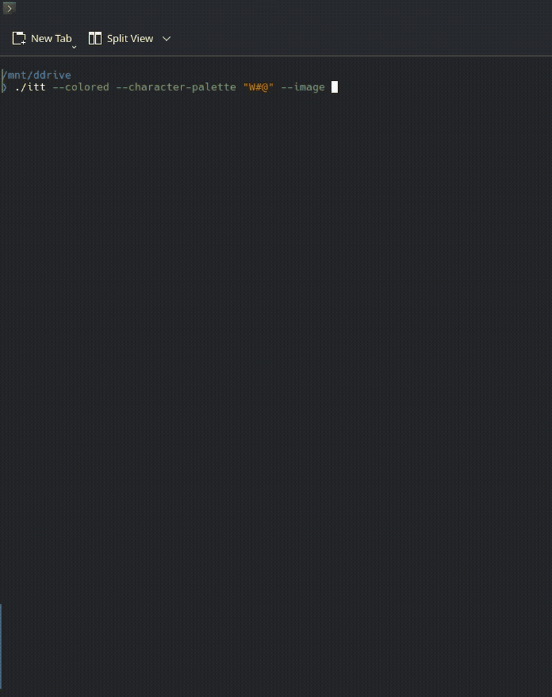

ITT
====

ITT is a simple image to text converter.

Installation
------------

Unpack the tar archive and execute the program in your terminal with `YOUR_DIRECTORY/itt [options]`,
if necessary you may need to grant executable permissions with `chmod -x YOUR_DIRECTORY/itt`.

Usage
-----

ITT currently supports following options:
- `--image {image_uri}`, `-i {image_uri}`,   **_required_**   (provides path to the image)
- `--character-palette {string}`,   _optional_   (specifies characters used in the output e.g. "./#@", character at the beginning is the darkest pixel, while character at the end - the brightest pixel, if omitted, " ,.:-=+*#%@" will be used)
- `--colored`, `-c`,   _optional_   (makes the output colored by using ANSI truecolor escape)
- `--mono`,   _optional_   (makes the output not colored, default option)
- `--width {amount_of_characters}`, `-w {amount_of_characters}`,   _optional_   (by default it's width is that of a terminal)
- `--height {amount_of_characters}`, `-h {amount_of_characters}`,   _optional_   (by default it's height is that of a terminal)
- `--preserve`,   _optional_   (preserves aspect ratio, default option)
- `--stretch`,   _optional_   (stretches the image to the specified dimensions, does not preserve aspect ratio)

**Example usage:**
`~/itt -i "./test.jpg" --colored -h 20 -w 50 --stretch --character-palette "8#@"`

Building
--------

If you want to compile from source, you will need a rustup toolchain for your system.
In your terminal, navigate to the folder you've extracted the source code in and run `cargo run -- [options]` to execute it once in debug mode or run `cargo build --release` to build an executable found in `SOURCE_CODE_DIRECTORY/target/release`.
